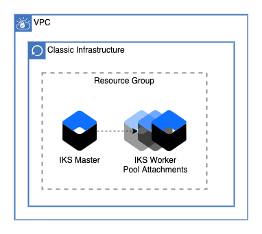

# IKS on Classic Cluster 

This module creates an IKS on classic cluster with worker pools in any number of zones.


---

### Table of Contents
1. [Cluster](##cluster)
2. [Module Variables](##Module-Variables)
3. [Outputs](##Outputs) (optional)
4. [As a Module in a Larger Architecture](##As-a-Module-in-a-Larger-Architecture)

---
## Cluster

This module creates an IKS cluster, it will also optionall provision workers in multiple zones from a list. 

---
## Module Variables

Variable | Type | Description | Default
---------|------|-------------|--------
`ibmcloud_api_key` | String | IBM Cloud IAM API Key |
`resource_group` | String | Name of resource group to provision resources |
`ibm_region` | String | IBM Cloud region where all resources will be deployed | `us-south`
`public_vlan_ids` | List | List of public vlans. The first will be for the master, any additional will be for worker pools. This is optional if you use `private_only` |
`private_vlan_ids` | List | List of private vlans The first will be for the master, any additional will be for worker pools |
`zones` | List | List of cluster zones The first will be for the master, any additional will be for worker pools. The zones must be in te same order as te VLAN Ids |
`cluster_name` | String | Name of openshift cluster to be created | `classic-cluster`
`default_pool_size` | String | Default pool size for cluster | `1`
`hardware` | String | Hardware type for cluster, shared or dedicated | `shared`
`machine_type` | String | hardware type for cluster | `b2c.4x16`
`private_only` | Boolean | Provision cluster workers on private only | `false`
---

## Outputs

- `cluster_id` : Cluster ID, will await the worker pool zone attachments before outputting

---
## As a Module in a Larger Architecture

Using Default Variables

```
module classic_cluster {
    source            = "<path to your code>"
    resource_group_id = "<path to your code>"
    public_vlan_ids   = "<path to your code>" 
    private_vlan_ids  = "<path to your code>" 
    zones             = "<path to your code>" 
    cluster_name      = "<path to your code>" 
}
```

Using All Custom Variables

```
module classic_cluster {
    source            = "<path to your code>"
    resource_group_id = "<path to your code>"
    public_vlan_ids   = "<path to your code>" 
    private_vlan_ids  = "<path to your code>" 
    zones             = "<path to your code>" 
    cluster_name      = "<path to your code>" 
    kube_version      = "<path to your code>" 
    default_pool_size = "<path to your code>" 
    hardware          = "<path to your code>" 
    machine_type      = "<path to your code>" 
    private_only      = "<path to your code>" 
}
```